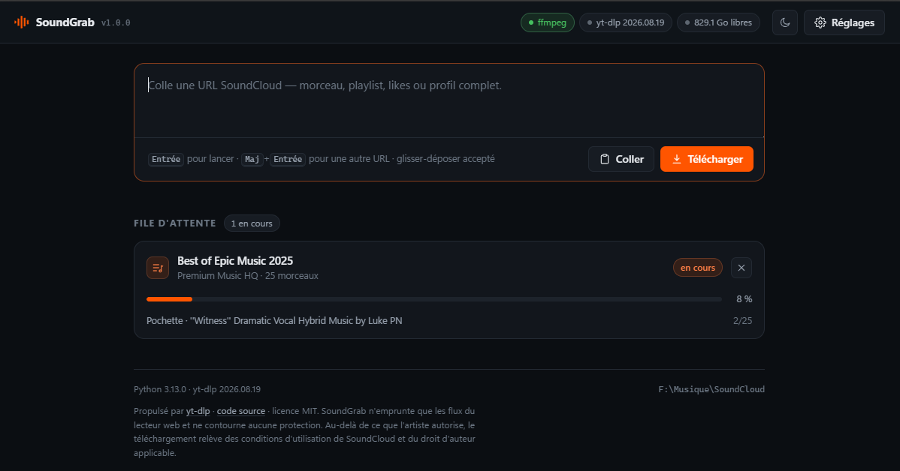

# SoundGrab

[](https://github.com/slayerfx/soundgrab/actions/workflows/ci.yml)
[](LICENSE)

SoundCloud downloader with a local web interface. Paste a URL and it pulls the
track, the playlist or the whole profile as tagged MP3 with cover art, filed
tidily on disk.

The engine is [yt-dlp](https://github.com/yt-dlp/yt-dlp): anything it handles
works here — SoundCloud, but also YouTube, Bandcamp and Mixcloud.



---

## Installation

Python 3.10 or later.

```
python -m venv .venv
.venv\Scripts\python.exe -m pip install -r requirements.txt
```

That file installs the project in editable mode, so `soundgrab` also becomes a
command.

### ffmpeg (required)

SoundCloud serves most tracks as fragmented HLS streams. Without ffmpeg there is
no reassembly, no MP3 conversion, no tags and no cover art.

```
winget install Gyan.FFmpeg
```

No need to sign out and back in: detection reads `PATH` from the Windows registry
and inspects winget's install locations, so it does not depend on the `PATH` the
process inherited. The warning banner at the top of the interface disappears as
soon as ffmpeg is found.

If you would rather not install anything system-wide, drop `ffmpeg.exe` into a
`bin/` folder at the project root and it will be picked up automatically.

### mutagen (optional)

`mutagen` lets yt-dlp embed cover art into `m4a`, `mp4`, `ogg` and `flac`
containers — so it only matters if you use the "original quality" format. For
MP3, ffmpeg does the job and `mutagen` is never called; when it is missing,
yt-dlp falls back to ffmpeg anyway.

It is also the only GPL dependency in the tree, which would complicate any frozen
distribution of the project. Hence: installed on request only.

```
.venv\Scripts\python.exe -m pip install -e ".[covers]"
```

## Running

Double-click `SoundGrab.bat`, or from a terminal:

```
.venv\Scripts\python.exe run.py
```

Once the project is installed, `soundgrab` does the same from anywhere.

The browser opens on `http://127.0.0.1:8731`. The console window must stay open
while downloads are running.

## Usage

Paste a URL and press Enter. Accepted forms:

| URL | Result |
|---|---|
| `soundcloud.com/artist/track` | one track |
| `soundcloud.com/artist/sets/playlist` | the whole playlist |
| `soundcloud.com/artist/tracks` | every track by the artist |
| `soundcloud.com/artist/likes` | all their likes (see Cookies) |
| `soundcloud.com/artist` | the full profile |

Several URLs at once: one per line. Dragging a link from the browser starts the
download straight away.

### The interface

It is three files served as-is — no framework, no build step, no font or script
loaded from a CDN. The tool therefore renders correctly with no connection.

- **Live progress.** The server pushes its state over
  [SSE](https://developer.mozilla.org/en-US/docs/Web/API/Server-sent_events) and
  only emits when something actually moved. Each card shows the current stage
  (probing, downloading, converting, cover art), the track being handled, the
  speed and the time left. Progress is mirrored in the tab title, readable
  without coming back to the page.
- **Light and dark themes**, following the system setting by default, forceable
  either way and remembered between sessions.
- **Keyboard and drag-and-drop.** `Enter` starts, `Shift+Enter` adds a line,
  `Escape` closes the settings panel; a link dropped from the browser goes
  straight through.
- **Accessibility.** State changes are announced to screen readers, but progress
  is not — announcing it would drown the user under hundreds of messages. Bars
  carry `role="progressbar"`, the collapsed panel is `inert`, and animations
  disappear when the system asks for reduced motion.
- **Automatic recovery.** If the server stops, a "reconnecting" chip appears and
  the stream picks itself back up on return.

### Other platforms

YouTube, YouTube Music, Bandcamp and Mixcloud work with no particular setup,
playlists included. Two differences worth knowing about YouTube:

- **The audio is better than SoundCloud's**: Opus around 150 kbps against 128 on
  the SoundCloud side.
- **The tags are poor.** An ordinary video exposes neither artist, nor title, nor
  album: yt-dlp falls back to the channel name as the artist, and files end up
  filed under it. The "Infer artist from title" option is far more useful here
  than on SoundCloud, most titles following the `Artist - Title` shape.
  **YouTube Music** links, on the other hand, fill artist, title and album
  correctly.

YouTube thumbnails being 16:9, they are centre-cropped to a square before being
embedded — otherwise the cover shows up as a rectangle in players and DJ
software.

## How files are filed

```
Music\SoundGrab\
  Artist\
    Playlist name\
      001 - First track.mp3
      002 - Second track.mp3
    Track outside any playlist.mp3
```

The track number preserves the playlist order, which stops DJ software from
shuffling everything alphabetically.

## Settings

Reachable through the **Settings** button, stored in `data/config.json`.

- **Destination folder** — the library root.
- **Format** — MP3 320 kbps, or the original stream with no re-encoding. Worth
  noting: SoundCloud often only serves 128 kbps, so 320 is a container ceiling,
  not a real quality gain. Original quality is only available when the artist
  enabled downloads on the track.
- **MP3 bitrate** — 320 kbps by default. No effect when the format is set to
  original quality; the field greys out.
- **Simultaneous downloads** — 2 by default. Past 3, SoundCloud starts answering
  `429 Too Many Requests`. Lowering this does not cut running downloads: surplus
  workers retire once their current job is done.
- **Parallel fragments** — applies inside a single track. SoundCloud serves
  chunked HLS: raising this speeds up an isolated track, where simultaneous
  downloads speed up a playlist.
- **Never re-download** — a log (`data/archive.txt`) remembers every track
  already taken. Re-running a playlist therefore only fetches what is new: this
  is what makes it possible to resync a profile every week without redoing
  everything.
- **Infer artist from title** — splits `Artist - Title` shaped titles to fill the
  artist tag properly. Off by default, because a title like `01 - Intro` would be
  misread.
- **Browser cookies** — needed for the likes of a private account or
  subscriber-only tracks. Reads the chosen browser's cookies, locally.
- **Reachable from the local network** — exposes the interface on `0.0.0.0` so you
  can drive it from a phone. Requires a restart, and a Windows firewall rule on
  the chosen port. See **Network exposure** below.
- **ffmpeg path** — only worth filling in when automatic detection fails. The
  folder containing `ffmpeg.exe` is enough; the path to the binary works too.
- **Port** — 8731 by default. Restart required. Below 1024, opening the port would
  need administrator rights.

## Network exposure

Without `lan_access`, SoundGrab only listens on `127.0.0.1`: nothing leaves the
machine. Two protections apply regardless.

**Validated `Host` header.** A website can point its own domain at `127.0.0.1` —
this is *DNS rebinding* — so that its scripts count as the same origin as
SoundGrab and can drive the API. Its request then carries its own domain in the
`Host` header, the only thing that gives it away: any `Host` that is not a local
IP address is refused.

**Host-machine-only actions.** With `lan_access`, the API has no authentication.
A client on the network can watch the queue and add URLs to it, but neither
change the configuration nor open the file explorer: letting `output_dir` be
rewritten from the network would amount to handing out arbitrary writes to the
disk. It remains a machine open on a network — only enable it on one you trust.

## Development

```
.venv\Scripts\python.exe -m pip install -e ".[dev]"
.venv\Scripts\python.exe -m pytest
.venv\Scripts\python.exe -m ruff check .
```

The tests cover `jobs.py` and `config.py` — shared state, locks, bounds,
persistence — plus the API's input guards. None of them touch the network or
ffmpeg, and an `autouse` fixture redirects the configuration to a temporary
folder: running the suite cannot overwrite your settings.

CI replays lint and tests on Windows and Linux, on Python 3.10 and 3.13.

## Troubleshooting

Every failure is reported with its actual cause, and the raw yt-dlp message stays
available in the card's expandable "problems" list.

| Message | What to do |
|---|---|
| Server unreachable | Check the network connection, or a proxy standing in the way. |
| Not found | The track was removed, or the URL is wrong. |
| Access denied | Private or subscriber-only content: fill in browser cookies in the settings. |
| SoundCloud is rate limiting | Drop simultaneous downloads to 1 and wait a few minutes. The limit is per IP address. |
| Unsupported URL | The site is not handled by yt-dlp. |
| Content blocked in this country | Geo-restricted track. |

**A track fails in the middle of a playlist** — the rest carries on regardless.
The detail sits in the card's expandable "problems" list.

**yt-dlp no longer recognises SoundCloud** — the site changes regularly. Update:

```
.venv\Scripts\python.exe -m pip install --upgrade yt-dlp
```

## Scope of use

SoundCloud allows downloading when the artist enables it on their track, and a
large share of the catalogue is under a Creative Commons licence. Beyond that,
downloading falls under the site's terms of use and the applicable copyright law.
The tool circumvents no protection: it uses the same streams as the web player.

## Layout

```
run.py                  launcher for a double-click
pyproject.toml          metadata, dependencies, ruff and pytest config
soundgrab/
  cli.py                server startup, opens the browser
  config.py             persistent settings, bounds, ffmpeg detection
  jobs.py               job state, lock-protected, versioned for SSE
  downloader.py         queue, workers, yt-dlp integration
  server.py             FastAPI API, event stream, network guards
  web/
    index.html          structure, SVG icon set, card template
    style.css           light/dark themes, layout
    app.js              job rendering, settings, SSE stream
    favicon.svg
docs/
  interface.png         screenshot used by this README
tests/
  conftest.py           configuration isolation
  test_jobs.py          shared state, cancellation, bounds, concurrency
  test_config.py        persistence, unknown keys, ffmpeg detection
  test_api.py           input validation, network guards
data/                   (git-ignored)
  config.json           settings
  archive.txt           log of tracks already downloaded
```

## Licence

MIT, see [LICENSE](LICENSE).
